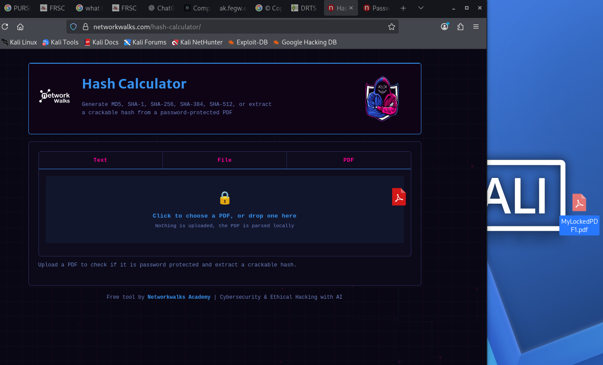
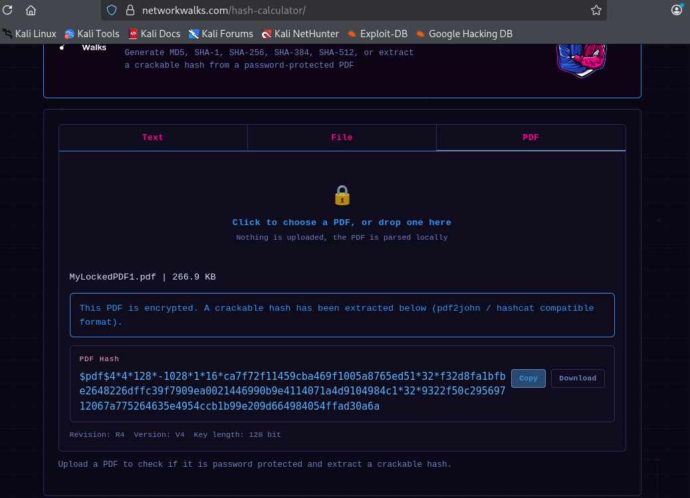
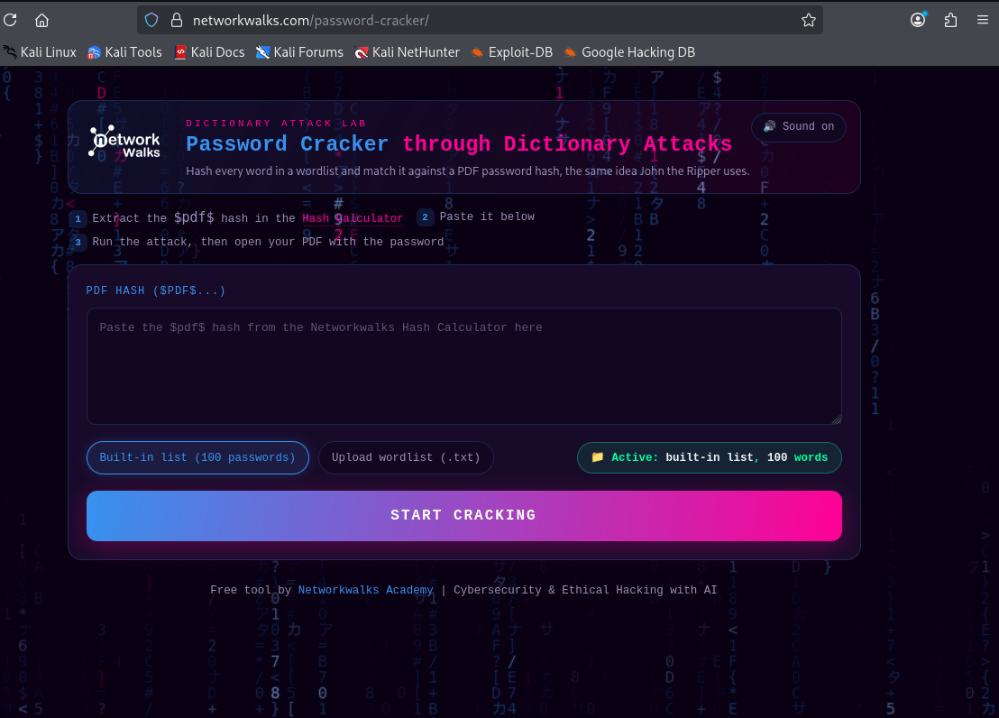
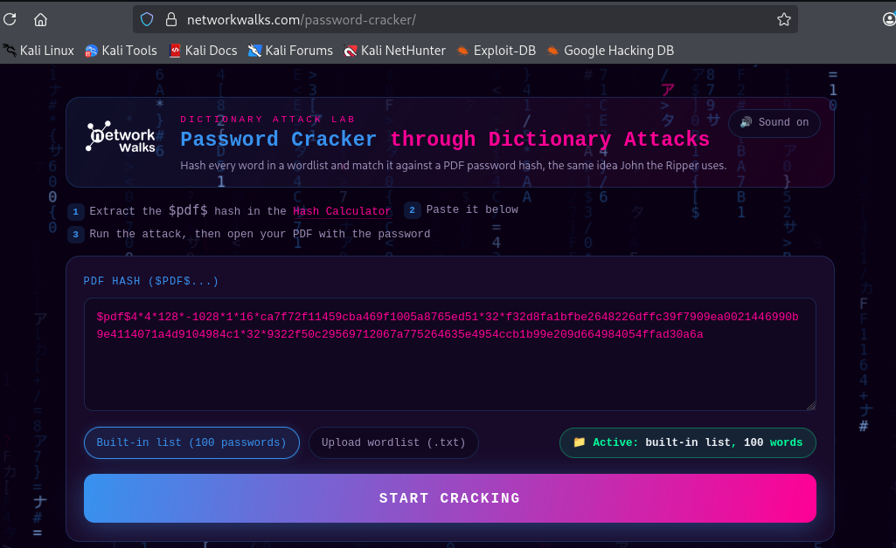
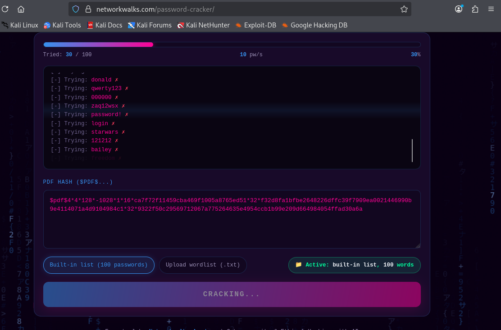
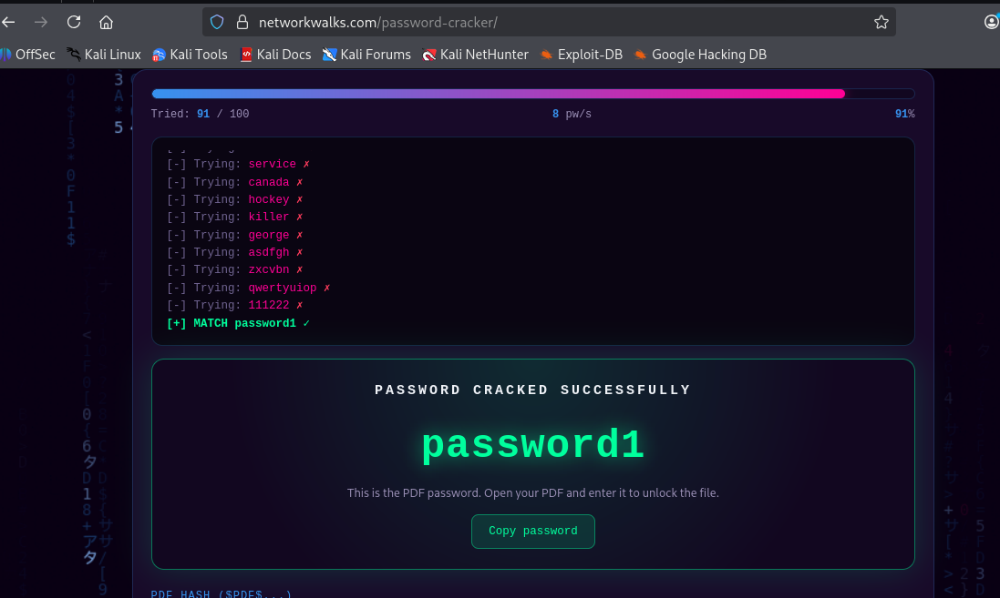
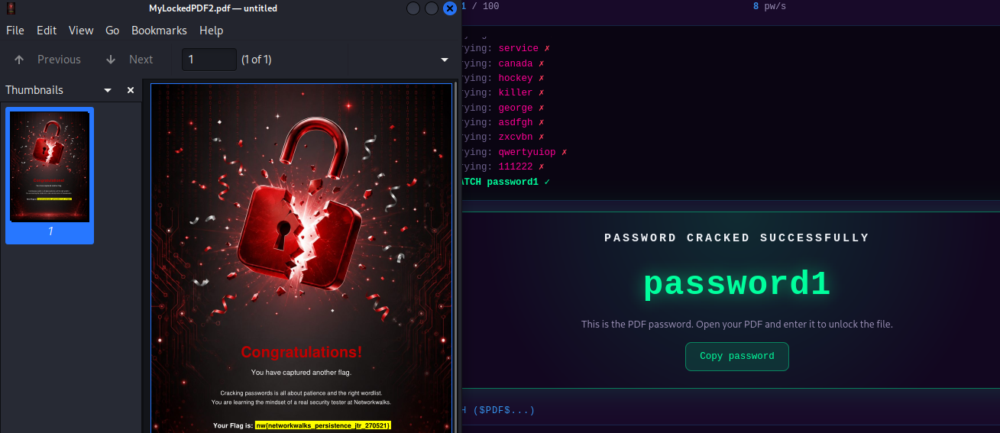

# Case Study: Cracking a Password-Protected PDF Using Browser-Based Tools

**Category:** Cybersecurity | Ethical Hacking | Password Security **Tools Used:** Networkwalks Hash Calculator, Networkwalks Password Cracker

---

## Overview

As part of my hands-on cybersecurity training, I completed a lab exercise on password recovery using two free, browser-based tools built by Networkwalks — the **Hash Calculator** and the **Password Cracker**. Unlike command-line tools such as John the Ripper, these run entirely client-side in the browser, with no installation required, making the underlying concept of password cracking accessible to anyone with a laptop and an internet connection.

The exercise reinforced the same core lesson as any password-auditing lab: weak, common passwords fall almost immediately to a basic dictionary attack — and that's exactly why strong, unique passwords matter.

---

## Objective

Crack the password of a protected PDF file (`MyLockedPDF1.pdf`) using the Networkwalks Hash Calculator to extract a crackable hash, then the Networkwalks Password Cracker to recover the actual password via a dictionary attack.

---

## Methodology

**1. Opened the Hash Calculator** The Hash Calculator is a general-purpose hashing tool (MD5, SHA-1, SHA-256, SHA-384, SHA-512) that also includes a dedicated PDF mode for extracting a crackable hash directly from an encrypted file — effectively a browser-based equivalent of the `pdf2john` utility used in command-line workflows.

**2. Uploaded the Locked PDF** Switched to the PDF tab and uploaded `MyLockedPDF1.pdf`. Because everything runs locally in the browser using the Web Crypto API, the file itself is never uploaded to a server — it's only parsed client-side to extract its hash. That's a meaningful detail from a security and privacy standpoint: the sensitive document never actually leaves your machine.

**3. Extracted and Copied the Hash** The tool read the PDF's encryption metadata and returned a hash in the same format `pdf2john` would produce — starting with `$pdf$...` and including the revision, version, and key length. This confirms both tools are doing conceptually identical work under the hood; only the interface differs.

**4. Opened the Password Cracker** The companion tool, Password Cracker, is explicitly built around the same logic John the Ripper uses: hash every candidate word in a wordlist and compare it against the target hash until a match is found. It ships with a built-in 100-password list, with the option to upload a custom wordlist for broader coverage.

**5. Pasted the Hash** Pasted the `$pdf$...` hash extracted in Step 3 into the cracker's input field, ready to run the attack.

**6. Ran the Dictionary Attack** Clicked **Start Cracking**. The tool worked through its wordlist in real time, visibly trying each candidate password (`donald`, `qwerty123`, `000000`, `zaq12wsx`, and so on) and rejecting each failed guess — a clear, visual demonstration of exactly what a dictionary attack looks like under the hood, something command-line tools don't always show as transparently.

**7. Password Cracked** After 91 of the 100 candidate passwords, the tool matched `password1` and confirmed success.

**8. Verified on a Second File** Repeated the entire process against a second locked PDF (`MyLockedPDF2.pdf`) for good measure — successfully cracking it and capturing the embedded flag, confirming the workflow was repeatable and not a one-off result.

---

## Key Takeaways

- **No installation, same result.** These browser tools reach the exact same outcome as command-line utilities like John the Ripper — proof that the underlying attack concept (extract hash → attack hash → verify password) doesn't depend on any specific tool.
- **Weak passwords fail fast.** `password1` was cracked in under 100 attempts against a small, generic wordlist — a stark illustration of why "add a number to a common word" is not a real security strategy.
- **Transparency aids learning.** Watching each password attempt scroll by in real time made the mechanics of a dictionary attack far more intuitive than a command-line tool's minimal output — useful both for personal understanding and for explaining the concept to others.
- **Privacy-conscious tooling matters.** Because hashing happens client-side in the browser, the actual protected file is never transmitted anywhere — a detail worth checking for whenever using any "free online" security tool.

---

## Why This Matters

Being able to demonstrate the same security concept across multiple tools — command-line and browser-based — shows a deeper grasp of *why* an attack works, not just *how* to run one specific program. That distinction matters in blue team, GRC, and penetration testing roles, where you're often expected to explain risk to non-technical stakeholders using accessible tools and simple demonstrations, not just terminal output.

---

*This is part of an ongoing hands-on cybersecurity learning journey — documenting real lab work as I build toward a career in blue team defense, threat detection, and AI-augmented security operations.*

#CyberSecurity #EthicalHacking #PasswordSecurity #InfoSec #BlueTeam #LearningInPublic #Networkwalks
