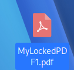
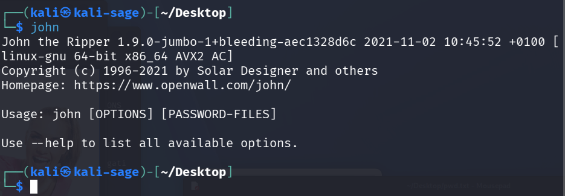
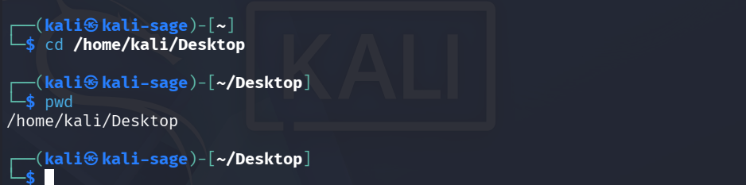
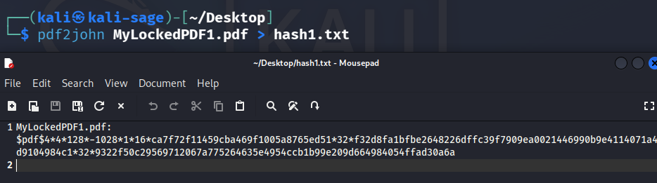
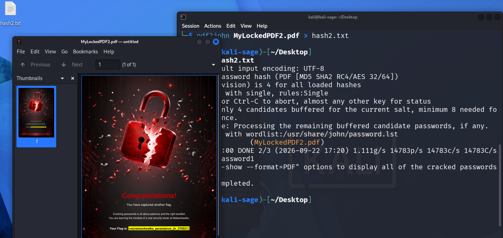
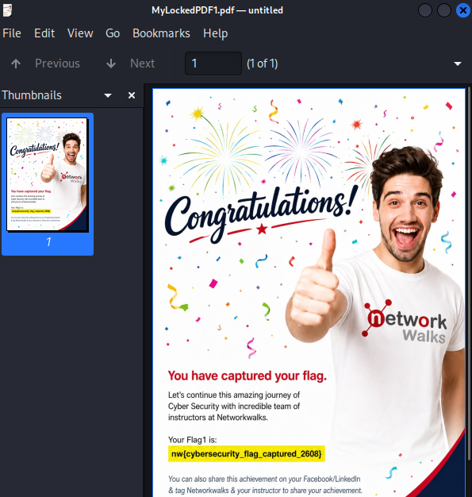
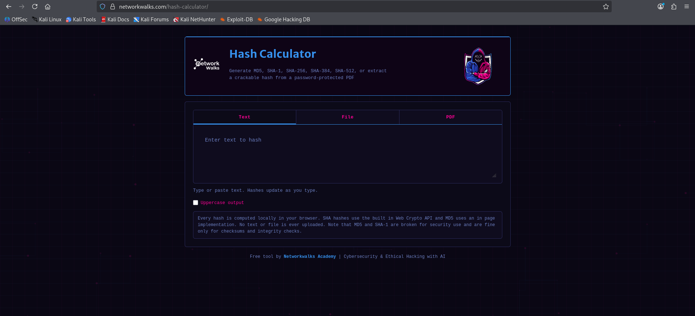

# 🔐 Password Cracking Lab — John the Ripper & Networkwalks Tools


---

## 📌 Project Overview

This repository documents my **Week 3 practical project** from the **Networkwalks Cybersecurity Academy**, covering **Project Module 1** and **Project Module 2**.

The objective across both modules was to recover the password of encrypted PDF files, using two different approaches:

1. **John the Ripper (JTR)** — the industry-standard command-line password auditing tool, run on **Kali Linux**.
2. **Networkwalks Hash Calculator + Password Cracker** — free, browser-based tools that replicate the same hash-extraction and dictionary-attack logic, with no installation required.

Both approaches were used to extract a crackable hash from a password-protected PDF and recover its original password via a **dictionary attack**, then verify the result by successfully opening the file.

### Required Week 3 Modules

- **W3-PM1** — Password Cracking with JTR (John the Ripper & Johnny GUI)
- **W3-PM2** — Password Cracking with Networkwalks Tools (Hash Calculator & Password Cracker)

---

## 🎯 Objectives

- Extract a crackable hash from a password-protected PDF file.
- Run a dictionary attack against the extracted hash using John the Ripper.
- Repeat the process using Networkwalks' free browser-based tools.
- Verify each recovered password by successfully opening the original PDF.
- Compare the command-line and browser-based approaches.
- Document the process and reinforce understanding of password security.

---

## 🧪 Lab Environment

| Component | Details |
|---|---|
| Operating System | Kali Linux |
| Password Cracking Tool | John the Ripper (JTR) 1.9.0-jumbo |
| Hash Extraction Utility | `pdf2john` (bundled with JTR) |
| Browser Tool 1 | [Networkwalks Hash Calculator](https://networkwalks.com/hash-calculator/) |
| Browser Tool 2 | [Networkwalks Password Cracker](https://networkwalks.com/password-cracker/) |
| Target Files | `MyLockedPDF1.pdf`, `MyLockedPDF2.pdf`, `MyLockedPDF3.pdf` |
| Hash Files | `hash1.txt`, `hash2.txt` |

---

## 🗺️ Lab Workflow

```
Password-protected PDF
        │
        ▼
Extract PDF hash
        │
        ├───────────────────────┐
        ▼                       ▼
  John the Ripper         Networkwalks
  (pdf2john, CLI)          Hash Calculator
        │                       │
        ▼                       ▼
  Dictionary attack       Extract $pdf$ hash
        │                       │
        │                       ▼
        │                 Networkwalks
        │                 Password Cracker
        │                       │
        └───────────┬───────────┘
                    ▼
             Recovered password
                     │
                     ▼
          Open & verify PDF file
```

---

## 🧩 Module 1 — Password Cracking with John the Ripper

**Tool:** John the Ripper (CLI), run directly on Kali Linux — no installation required since JTR ships pre-installed.

### Step 1 — Target File

The starting point was a password-protected PDF that could not be opened without the correct password.



### Step 2 — Confirming John the Ripper Was Available

Running `john` with no arguments confirmed the tool was installed and displayed its usage syntax.



### Step 3 — Navigating to the Working Directory

Moved into the folder containing the target file to keep all hash files and PDFs organized in one place.

```bash
cd /home/kali/Desktop
pwd
```



### Step 4 — Extracting the Hash with `pdf2john`

Used `pdf2john`, a helper script bundled with JTR, to extract a crackable hash from the PDF's encryption metadata.

```bash
pdf2john MyLockedPDF1.pdf > hash1.txt
```


### Step 5 — Reviewing the Extracted Hash

The resulting `hash1.txt` file contained the hash in the standard `$pdf$...` format, ready to be cracked.


### Step 6 — Running the Attack & Recovering the Password

John the Ripper ran a **wordlist (dictionary) attack** against the hash using its bundled password list, recovering the password almost instantly.

**Recovered password:** `password1`



### Step 7 — Verifying the Result

Opened the PDF using the recovered password — the file unlocked successfully, confirming the crack was accurate.



### Step 8 — Repeating on Additional Files

Applied the identical workflow to two further locked PDFs, successfully recovering both passwords and capturing their embedded flags — confirming the process was repeatable, not a one-off result.




---

## 🧩 Module 2 — Password Cracking with Networkwalks Tools

**Tools:** Networkwalks Hash Calculator + Password Cracker — both free, browser-based, and requiring no installation. Everything runs client-side, so the protected file itself is never uploaded anywhere.

### Step 1 — Opening the Hash Calculator

The Hash Calculator supports MD5, SHA-1, SHA-256, SHA-384, and SHA-512, and includes a dedicated PDF mode that extracts a crackable hash directly from an encrypted file — a browser-based equivalent of `pdf2john`.



### Step 2 — Uploading the Locked PDF

Switched to the PDF tab and uploaded `MyLockedPDF1.pdf`. The file is parsed entirely in-browser using the Web Crypto API — nothing is sent to a server.


### Step 3 — Extracting the Hash

The tool returned a hash in the same `$pdf$...` format `pdf2john` produces, confirming both tools perform conceptually identical work.


### Step 4 — Opening the Password Cracker

The companion Password Cracker tool runs the same logic John the Ripper uses: hash every candidate word in a wordlist and compare it against the target hash. It ships with a built-in 100-password list, or a custom wordlist can be uploaded.


### Step 5 — Pasting the Hash

Pasted the extracted `$pdf$...` hash into the cracker's input field.


### Step 6 — Running the Dictionary Attack

Clicked **Start Cracking**. The tool visibly worked through its wordlist in real time — trying each candidate password and rejecting failed guesses — offering a clear, transparent view of a dictionary attack in action.


### Step 7 — Password Cracked

After 91 of 100 attempts, the tool matched the password: `password1` — the same result recovered in Module 1, confirming both approaches converge on the same answer.


### Step 8 — Verifying on a Second File

Repeated the process against `MyLockedPDF2.pdf`, successfully cracking it and capturing the embedded flag.


---

## 📊 Results

| PDF File | Method | Result |
|---|---|---|
| MyLockedPDF1.pdf | John the Ripper (CLI) | ✅ Password recovered — `password1` |
| MyLockedPDF2.pdf | John the Ripper (CLI) | ✅ Password recovered, flag captured |
| MyLockedPDF3.pdf | John the Ripper (CLI) | ✅ Password recovered, flag captured |
| MyLockedPDF1.pdf | Networkwalks Hash Calculator + Password Cracker | ✅ Password recovered — `password1` |
| MyLockedPDF2.pdf | Networkwalks Hash Calculator + Password Cracker | ✅ Password recovered, flag captured |

**Final Result: All targeted PDFs successfully recovered across both methods.**

---

## 🔍 Comparing the Two Approaches

| | John the Ripper (CLI) | Networkwalks Tools (Browser) |
|---|---|---|
| Setup | Pre-installed on Kali, no config needed | Zero install, runs in any browser |
| Hash extraction | `pdf2john` script | Hash Calculator (PDF mode) |
| Attack method | Wordlist attack via JTR engine | Wordlist attack via built-in/uploaded list |
| Visibility | Minimal live feedback during the attack | Real-time visual log of every attempt |
| Best suited for | Larger wordlists, rule-based attacks, professional pentest workflows | Quick checks, demonstrations, learning without setup |

Both methods reached the identical result, reinforcing that the **tool is just an interface** — the underlying attack (extract hash → try candidate passwords → compare results) stays the same regardless of whether it's run from a terminal or a browser.

---

## 🧠 Key Learning Outcomes

### PDF Hash Extraction
Learned how a password-protected PDF's encryption metadata can be converted into a crackable hash, using both `pdf2john` on the command line and the Networkwalks Hash Calculator in-browser.

### Dictionary-Based Attacks
Observed firsthand how a password cracker tests candidate passwords from a wordlist against a target hash until a match is found — and how quickly this succeeds against common, weak passwords.

### CLI vs. Browser-Based Tools
Working with both approaches provided practical exposure to two different interfaces for the same underlying security concept — a command-driven workflow versus a fully visual, real-time one.

### Password Security
The exercise reinforced a core security principle:

> **Password strength matters.** Common or predictable passwords fall almost instantly to a basic dictionary attack, while long, random passphrases dramatically increase the effort required for recovery.

---

## ⚖️ Ethical & Legal Scope

This work was performed as part of a **controlled cybersecurity training lab** using files provided specifically for this educational exercise.

Password-cracking techniques should only ever be used against systems, files, or accounts for which you have **explicit authorization**. The purpose of this project was strictly to understand:

- Password security and hash extraction
- Dictionary-based attack mechanics
- Password recovery workflows
- Ethical hacking methodology
- Defensive security awareness

---

## 📌 Project Information

**Program:** Cybersecurity & Ethical Hacking — Networkwalks Academy
**Modules:** W3-PM1 (Password Cracking with JTR) · W3-PM2 (Password Cracking with Networkwalks Tools)

---

## 👤 Author

**Adebayo Timothy**
Cybersecurity Professional B083

---

## ✅ Conclusion

Week 3 provided hands-on exposure to password-cracking workflows using both traditional command-line tooling and modern browser-based security tools. The project strengthened my understanding of how protected files are analyzed, how crackable hashes are extracted, how dictionary attacks work in practice, and how recovered credentials are verified in a controlled, ethical environment.

#CyberSecurity #EthicalHacking #JohnTheRipper #PasswordCracking #InfoSec #BlueTeam #Networkwalks
